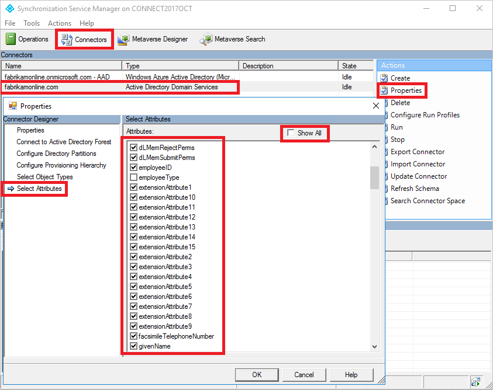
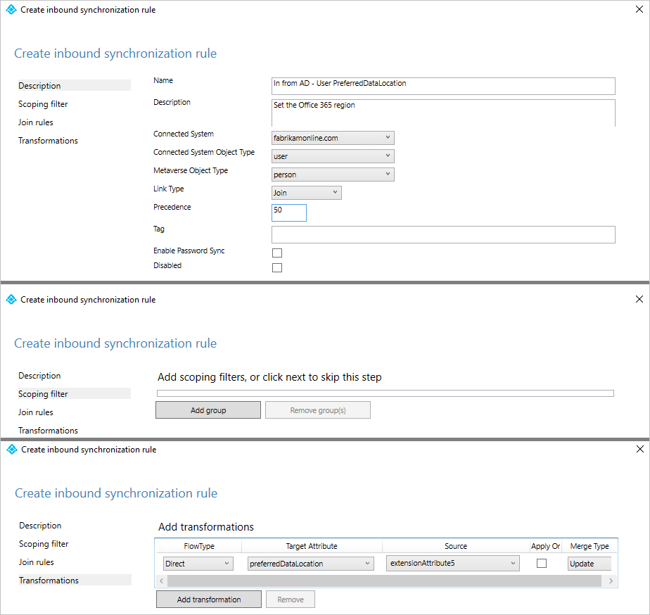
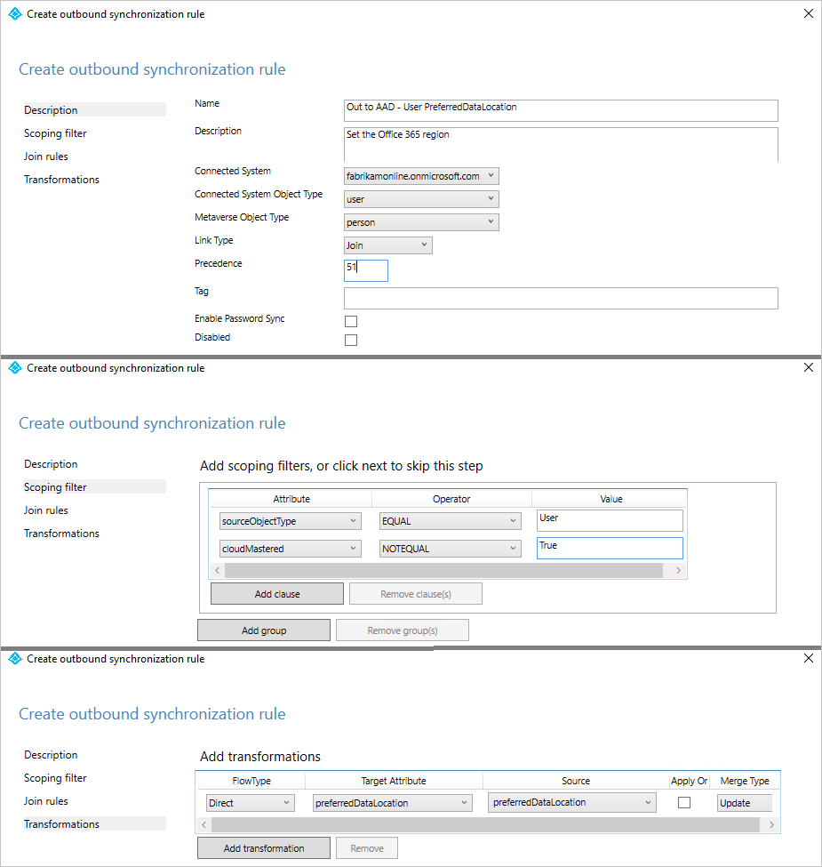
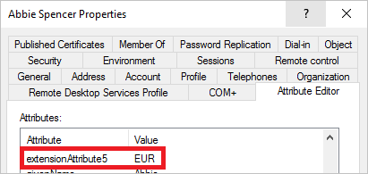

# Azure Active Directory Connect sync: Configure preferred data location for Office 365 resources
The purpose of this topic is to walk you through how to configure the attribute for preferred data location in Azure Active Directory (Azure AD) Connect sync. When someone uses Multi-Geo capabilities in Office 365, you use this attribute to designate the geo-location of the user’s Office 365 data. (The terms *region* and *geo* are used interchangeably.)

## Enable synchronization of preferred data location
By default, Office 365 resources for your users are located in the same geo as your Azure AD tenant. For example, if your tenant is located in North America, then the users' Exchange mailboxes are also located in North America. For a multinational organization, this might not be optimal.

By setting the attribute **preferredDataLocation**, you can define a user's geo. You can have the user's Office 365 resources, such as the mailbox and OneDrive, in the same geo as the user, and still have one tenant for your entire organization.

> [!IMPORTANT]
> Multi-Geo is currently available to customers with a minimum of 2,500 Office 365 Services subscriptions. Please talk to your Microsoft representative for details.
>
>

A list of all geos for Office 365 can be found in [Where is your data located?](https://aka.ms/datamaps).

The geos in Office 365 available for Multi-Geo are:

| Geo | preferredDataLocation value |
| --- | --- |
| Asia Pacific | APC |
| Australia | AUS |
| Canada | CAN |
| European Union | EUR |
| France | FRA |
| India | IND |
| Japan | JPN |
| Korea | KOR |
| United Kingdom | GBR |
| United States | NAM |

* If a geo is not listed in this table (for example, South America), then it cannot be used for Multi-Geo.
* The India geo is only available to customers with billing address and licenses purchased in this geo.
* Not all Office 365 workloads support the use of setting a user's geo.

### Azure AD Connect support for synchronization

Azure AD Connect supports synchronization of the **preferredDataLocation** attribute for **User** objects in version 1.1.524.0 and later. Specifically:

* The schema of the object type **User** in the Azure AD Connector is extended to include the **preferredDataLocation** attribute. The attribute is of the type, single-valued string.
* The schema of the object type **Person** in the metaverse is extended to include the **preferredDataLocation** attribute. The attribute is of the type, single-valued string.

By default, **preferredDataLocation** is not enabled for synchronization. This feature is intended for larger organizations. You must also identify an attribute to hold the Office 365 geo for your users, because there is no **preferredDataLocation** attribute in on-premises Active Directory. This is going to be different for each organization.

> [!IMPORTANT]
> Azure AD allows the **preferredDataLocation** attribute on **cloud User objects** to be directly configured by using Azure AD PowerShell. Azure AD no longer allows the **preferredDataLocation** attribute on **synchronized User objects** to be directly configured by using Azure AD PowerShell. To configure this attribute on **synchronized User objects**, you must use Azure AD Connect.

Before enabling synchronization:

* Decide which on-premises Active Directory attribute to be used as the source attribute. It should be of the type, **single-valued string**. In the steps that follow, one of the **extensionAttributes** is used.
* If you have previously configured the **preferredDataLocation** attribute on existing **synchronized User objects** in Azure AD by using Azure AD PowerShell, you must backport the attribute values to the corresponding **User** objects in on-premises Active Directory.

    > [!IMPORTANT]
    > If you do not backport these values, Azure AD Connect removes the existing attribute values in Azure AD when synchronization for the **preferredDataLocation** attribute is enabled.

* Configure the source attribute on at least a couple of on-premises Active Directory User objects now. You can use this for verification later.

The following sections provide the steps to enable synchronization of the **preferredDataLocation** attribute.

> [!NOTE]
> The steps are described in the context of an Azure AD deployment with single-forest topology, and without custom synchronization rules. If you have a multi-forest topology, custom synchronization rules configured, or have a staging server, you should adjust the steps accordingly.

## Step 1: Disable sync scheduler and verify there is no synchronization in progress
To avoid unintended changes being exported to Azure AD, ensure that no synchronization takes place while you are in the middle of updating synchronization rules. To disable the built-in sync scheduler:

1. Start a PowerShell session on the Azure AD Connect server.
2. Disable scheduled synchronization by running this cmdlet: `Set-ADSyncScheduler -SyncCycleEnabled $false`.
3. Start the **Synchronization Service Manager** by going to **START** > **Synchronization Service**.
4. Select the **Operations** tab, and confirm there is no operation with the status *in progress*.

## Step 2: Add the source attribute to the on-premises Active Directory Connector schema
Not all Azure AD attributes are imported into the on-premises Active Directory Connector space. If you have selected to use an attribute that is not synchronized by default, then you need to import it. To add the source attribute to the list of the imported attributes:

1. Select the **Connectors** tab in the Synchronization Service Manager.
2. Right-click the on-premises Active Directory Connector, and select **Properties**.
3. In the pop-up dialog box, go to the **Select Attributes** tab.
4. Make sure the source attribute you selected to use is checked in the attribute list. If you do not see your attribute, select the **Show All** check box.
5. To save, select **OK**.

## Step 3: Add **preferredDataLocation** to the Azure AD Connector schema
By default, the **preferredDataLocation** attribute is not imported into the Azure AD Connector space. To add it to the list of imported attributes:

1. Select the **Connectors** tab in the Synchronization Service Manager.
2. Right-click the Azure AD connector, and select **Properties**.
3. In the pop-up dialog box, go to the **Select Attributes** tab.
4. Select the **preferredDataLocation** attribute in the list.
5. To save, select **OK**.

## Step 4: Create an inbound synchronization rule
The inbound synchronization rule permits the attribute value to flow from the source attribute in on-premises Active Directory to the metaverse.

1. Start the **Synchronization Rules Editor** by going to **START** > **Synchronization Rules Editor**.
2. Set the search filter **Direction** to be **Inbound**.
3. To create a new inbound rule, select **Add new rule**.
4. Under the **Description** tab, provide the following configuration:

    | Attribute | Value | Details |
    | --- | --- | --- |
    | Name | *Provide a name* | For example, “In from AD – User preferredDataLocation” |
    | Description | *Provide a custom description* |  |
    | Connected System | *Pick the on-premises Active Directory Connector* |  |
    | Connected System Object Type | **User** |  |
    | Metaverse Object Type | **Person** |  |
    | Link Type | **Join** |  |
    | Precedence | *Choose a number between 1–99* | 1–99 is reserved for custom sync rules. Do not pick a value that is used by another synchronization rule. |

5. Keep the **Scoping filter** empty, to include all objects. You might need to tweak the scoping filter according to your Azure AD Connect deployment.
6. Go to the **Transformation tab**, and implement the following transformation rule:

    | Flow type | Target attribute | Source | Apply once | Merge type |
    | --- | --- | --- | --- | --- |
    |Direct | preferredDataLocation | Pick the source attribute | Unchecked | Update |

7. To create the inbound rule, select **Add**.

## Step 5: Create an outbound synchronization rule
The outbound synchronization rule permits the attribute value to flow from the metaverse to the **preferredDataLocation** attribute in Azure AD:

1. Go to the **Synchronization Rules Editor**.
2. Set the search filter **Direction** to be **Outbound**.
3. Select **Add new rule**.
4. Under the **Description** tab, provide the following configuration:

    | Attribute | Value | Details |
    | ----- | ------ | --- |
    | Name | *Provide a name* | For example, “Out to Azure AD – User preferredDataLocation” |
    | Description | *Provide a description* ||
    | Connected System | *Select the Azure AD Connector* ||
    | Connected System Object Type | **User** ||
    | Metaverse Object Type | **Person** ||
    | Link Type | **Join** ||
    | Precedence | *Choose a number between 1–99* | 1–99 is reserved for custom sync rules. Do not pick a value that is used by another synchronization rule. |

5. Go to the **Scoping filter** tab, and add a single scoping filter group with two clauses:

    | Attribute | Operator | Value |
    | --- | --- | --- |
    | sourceObjectType | EQUAL | User |
    | cloudMastered | NOTEQUAL | True |

    Scoping filter determines which Azure AD objects this outbound synchronization rule is applied to. In this example, we use the same scoping filter from “Out to AD – User Identity” OOB (out-of-box) synchronization rule. It prevents the synchronization rule from being applied to **User** objects that are not synchronized from on-premises Active Directory. You might need to tweak the scoping filter according to your Azure AD Connect deployment.

6. Go to the **Transformation** tab, and implement the following transformation rule:

    | Flow type | Target attribute | Source | Apply once | Merge type |
    | --- | --- | --- | --- | --- |
    | Direct | preferredDataLocation | preferredDataLocation | Unchecked | Update |

7. Close **Add** to create the outbound rule.

## Step 6: Run full synchronization cycle
In general, full synchronization cycle is required. This is because you have added new attributes to both the Active Directory and Azure AD Connector schema, and introduced custom synchronization rules. Verify the changes before exporting them to Azure AD. You can use the following steps to verify the changes, while manually running the steps that make up a full synchronization cycle.

1. Run **Full import** on the on-premises Active Directory Connector:

   1. Go to the **Operations** tab in the Synchronization Service Manager.
   2. Right-click the **on-premises Active Directory Connector**, and select **Run**.
   3. In the dialog box, select **Full Import**, and select **OK**.
   4. Wait for the operation to complete.

    > [!NOTE]
    > You can skip full import on the on-premises Active Directory Connector if the source attribute is already included in the list of imported attributes. In other words, you did not have to make any change during step 2 earlier in this article.

2. Run **Full import** on the Azure AD Connector:

   1. Right-click the **Azure AD Connector**, and select **Run**.
   2. In the dialog box, select **Full Import**, and select **OK**.
   3. Wait for the operation to complete.

3. Verify the synchronization rule changes on an existing **User** object.

   The source attribute from on-premises Active Directory, and **preferredDataLocation** from Azure AD, have been imported into each respective connector space. Before proceeding with the full synchronization step, do a preview on an existing **User** object in the on-premises Active Directory Connector space. The object you picked should have the source attribute populated. A successful preview with **preferredDataLocation** populated in the metaverse is a good indicator that you have configured the synchronization rules correctly. For information about how to do a preview, see [Verify the change](how-to-connect-sync-change-the-configuration.md#verify-the-change).

4. Run **Full Synchronization** on the on-premises Active Directory Connector:

   1. Right-click the **on-premises Active Directory Connector**, and select **Run**.
   2. In the dialog box, select **Full Synchronization**, and select **OK**.
   3. Wait for the operation to complete.

5. Verify **Pending Exports** to Azure AD:

   1. Right-click the **Azure AD Connector**, and select **Search Connector Space**.
   2. In the **Search Connector Space** dialog box:

        a. Set **Scope** to **Pending Export**. 
        b. Select all three check boxes, including **Add, Modify, and Delete**. 
        c. To view the list of objects with changes to be exported, select **Search**. To        examine the changes for a given object, double-click the object. 
        d. Verify that the changes are expected.

6. Run **Export** on the **Azure AD Connector**

   1. Right-click the **Azure AD Connector**, and select **Run**.
   2. In the **Run Connector** dialog box, select **Export**, and select **OK**.
   3. Wait for the operation to complete.

> [!NOTE]
> You might notice that the steps do not include the full synchronization step on the Azure AD Connector, or the export step on the Active Directory Connector. The steps are not required, because the attribute values are flowing from on-premises Active Directory to Azure AD only.

## Step 7: Re-enable sync scheduler
Re-enable the built-in sync scheduler:

1. Start a PowerShell session.
2. Re-enable scheduled synchronization by running this cmdlet: `Set-ADSyncScheduler -SyncCycleEnabled $true`

## Step 8: Verify the result
It is now time to verify the configuration and enable it for your users.

1. Add the geo to the selected attribute on a user. The list of available geos can be found in [this table](#enable-synchronization-of-preferreddatalocation).  

2. Wait for the attribute to be synchronized to Azure AD.
3. Using Exchange Online PowerShell, verify that the mailbox region has been set correctly.  
  
Assuming your tenant has been marked to be able to use this feature, the mailbox is moved to the correct geo. This can be verified by looking at the server name where the mailbox is located.
4. To verify that this setting has been effective over many mailboxes, use the script in the [TechNet gallery](https://gallery.technet.microsoft.com/office/PowerShell-Script-to-a6bbfc2e). This script also has a list of the server prefixes of all Office 365 datacenters, and which geo it is located in. It can be used as a reference in the previous step to verify the location of the mailbox.

## Next steps

Learn more about Multi-Geo in Office 365:

* [Multi-Geo sessions at Ignite](https://aka.ms/MultiGeoIgnite)
* [Multi-Geo in OneDrive](https://aka.ms/OneDriveMultiGeo)
* [Multi-Geo in SharePoint Online](https://aka.ms/SharePointMultiGeo)

Learn more about the configuration model in the sync engine:

* Read more about the configuration model in [Understanding Declarative Provisioning](concept-azure-ad-connect-sync-declarative-provisioning.md).
* Read more about the expression language in [Understanding Declarative Provisioning Expressions](concept-azure-ad-connect-sync-declarative-provisioning-expressions.md).

Overview topics:

* [Azure AD Connect sync: Understand and customize synchronization](how-to-connect-sync-whatis.md)
* [Integrating your on-premises identities with Azure Active Directory](whatis-hybrid-identity.md)
