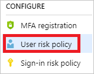
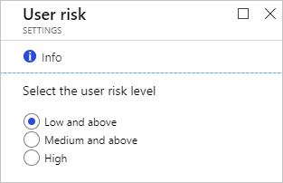
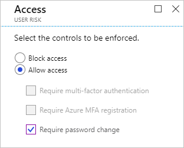
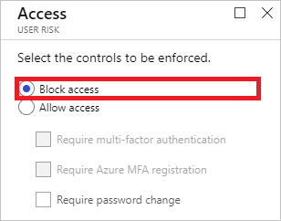
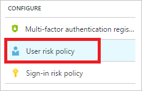

# How To: Configure the user risk policy

With the user risk, Azure AD detects the probability that a user account has been compromised. As an administrator, you can configure a user risk conditional access policy, to automatically respond to a specific user risk level.
 
This article provides you with the information you need to configure a user risk policy.

## What is a user risk policy?

Azure AD analyzes each sign-in of a user. The objective of the analysis is to detect suspicious actions that come along with the sign-in. In Azure AD, the suspicious actions the system can detect are also known as risk events. While some risk events can be detected in real-time, there are also risk events requiring more time. For example, to detect an impossible travel to atypical locations, the system requires an initial learning period of 14 days to learn about a user's regular behavior. There are several options to resolve detected risk events. For example, you can resolve individual risk events manually, or you can get them resolved using a sign-in risk or a user risk conditional access policy.

All risk events that have been detected for a user and didn't get resolved are known as active risk events. The active risk events that are associated with a user are known as user risk. Based on the user risk, Azure AD calculates a probability (low, medium, high) that a user has been compromised. The probability is called user  risk level.

The user risk policy is an automated response you can configure for a specific user risk level. With a user risk policy, you can block access to your resources or require a password change to get a user account back into a clean state.

## How do I access the user risk policy?
   
The sign-in risk policy is in the **Configure** section on the [Azure AD Identity Protection page](https://portal.azure.com/#blade/Microsoft_AAD_ProtectionCenter/IdentitySecurityDashboardMenuBlade/SignInPolicy).
   

## Policy settings

When you configure the sign-in risk policy, you need to set:

- The users and groups the policy applies to:

    

- The sign-in risk level that triggers the policy:

    

- The type of access you want to be enforced when your sign-in risk level has been met:  

    

- The state of your policy:

    

The policy configuration dialog provides you with an option to estimate the impact of your configuration.

## What you should know

You can set a user risk security policy to block users upon sign-in depending on the risk level.

Blocking a sign-in:

* Prevents the generation of new user risk events for the affected user
* Enables administrators to manually remediate the risk events affecting the user's identity and restore it to a secure state

## Best practices

Choosing a **High** threshold reduces the number of times a policy is triggered and minimizes the impact to users.
However, it excludes **Low** and **Medium** users flagged for risk from the policy, which may not secure identities or devices that were previously suspected or known to be compromised.

When setting the policy,

* Exclude users who are likely to generate a lot of false-positives (developers, security analysts)
* Exclude users in locales where enabling the policy is not practical (for example no access to helpdesk)
* Use a **High** threshold during initial policy roll out, or if you must minimize challenges seen by end users.
* Use a **Low** threshold if your organization requires greater security. Selecting a **Low** threshold introduces additional user sign-in challenges, but increased security.

The recommended default for most organizations is to configure a rule for a **Medium** threshold to strike a balance between usability and security.

For an overview of the related user experience, see:

* [Compromised account recovery flow](flows.md#compromised-account-recovery).  
* [Compromised account blocked flow](flows.md#compromised-account-blocked).  

**To open the related configuration dialog**:

- On the **Azure AD Identity Protection** blade, in the **Configure** section, click **User risk policy**.

    

## Next steps

To get an overview of Azure AD Identity Protection, see the [Azure AD Identity Protection overview](overview.md).
