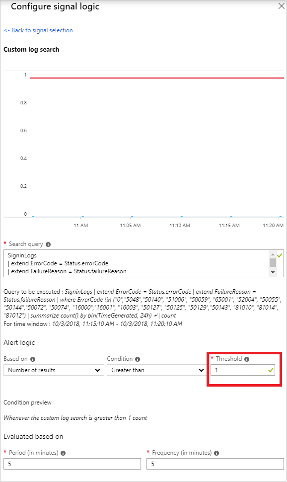
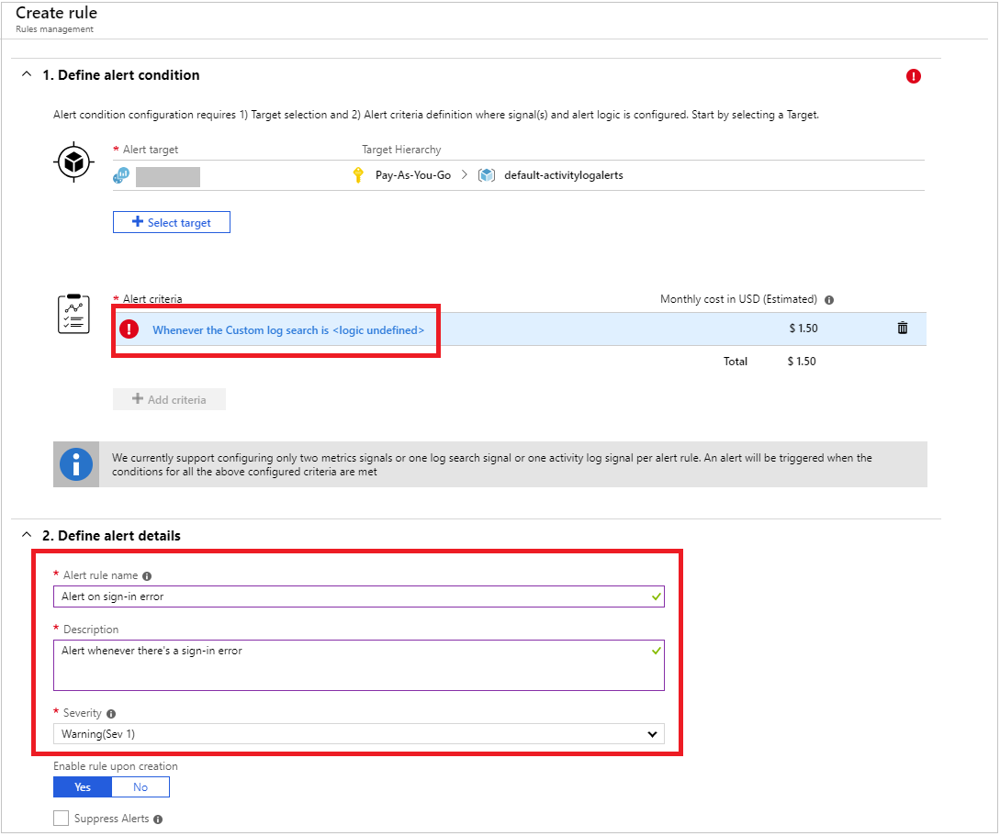

# Install and use the Log Analytics views for Azure Active Directory

The Azure Active Directory Log Analytics views helps you analyze and search the Azure AD activity logs in your Azure AD tenant. Azure AD activity logs include:

* Audit logs: The [audit logs activity report](concept-audit-logs.md) gives you access to the history of every task that's performed in your tenant.
* Sign-in logs: With the [sign-in activity report](concept-sign-ins.md), you can determine who performed the tasks that are reported in the audit logs.

## Prerequisites

To use the Log Analytics views, you need:

* A Log Analytics workspace in your Azure subscription. Learn how to [create a Log Analytics workspace](https://docs.microsoft.com/azure/log-analytics/log-analytics-quick-create-workspace).
* First, complete the steps to [route the Azure AD activity logs to your Log Analytics workspace](howto-integrate-activity-logs-with-log-analytics.md).
* Download the views from the [GitHub repository](https://aka.ms/AADLogAnalyticsviews) to your local computer.

## Install the Log Analytics views

1. Navigate to your Log Analytics workspace. To do this, first navigate to the [Azure portal](https://portal.azure.com) and select **All services**. Type **Log Analytics** in the text box, and select **Log Analytics**. Select the workspace you routed the activity logs to, as part of the prerequisites.
2. Select **View Designer**, select **Import** and then select **Choose File** to import the views from your local computer.
3. Select the views you downloaded from the prerequisites and select **Save** to save the import. Do this for the **Azure AD Account Provisioning Events** view, **Sign-ins Events** view and the **Users Performing Consent** view.

## Use the views

1. Navigate to your Log Analytics workspace. To do this, first navigate to the [Azure portal](https://portal.azure.com) and select **All services**. Type **Log Analytics** in the text box, and select **Log Analytics**. Select the workspace you routed the activity logs to, as part of the prerequisites.

2. Once you're in the workspace, select **Workspace Summary**. You should see the following three views:

    * **Azure AD Account Provisioning Events**: This view shows reports related to auditing provisioning activity, such as the number of new users provisioned and provisioning failures, number of users updated and update failures and the number of users de-provisioned and corresponding failures.    
    * **Sign-ins Events**: This view shows the most relevant reports related to monitoring sign-in activity, such as sign-ins by application, user, device, as well as a summary view tracking the number of sign-ins over time.
    * **Users Performing Consent**: This view shows reports related to user consent, such as the consent grants by user, sign-ins by users who granted consent as well as sign-ins by application for all consent-based applications. 

3. Select either of these views to jump in to the individual reports. You can also set alerts on any of the report parameters. For example, let's set an alert for every time there's a sign-in error. To do this, first select the **Sign-ins Events** view, select **Sign-in errors over time** report and then select **Analytics** to open the details page, with the actual query behind the report. 

    

4. Select **Set Alert**, and then select **Whenever the Custom log search is &lt;logic undefined&gt;** under the **Alert criteria** section. Since we want to alert whenever there's a sign-in error, set the **Threshold** of the default alert logic to **1** and then select **Done**. 

    

5. Enter a name and description for the alert and set the severity to **Warning**.

    

6. Select the action group to alert. In general, this can be either a team you want to notify via email or text message, or it can be an automated task using webhooks, runbooks, functions, logic apps or external ITSM solutions. Learn how to [create and manage action groups in the Azure portal](https://docs.microsoft.com/azure/monitoring-and-diagnostics/monitoring-action-groups).

7. Select **Create alert rule** to create the alert. Now you will be alerted every time there's a sign-in error.

## Next steps

* [How to analyze activity logs in Log Analytics](howto-analyze-activity-logs-log-analytics.md)
* [Get started with Log Analytics in the Azure portal](https://docs.microsoft.com/azure/log-analytics/query-language/get-started-analytics-portal)