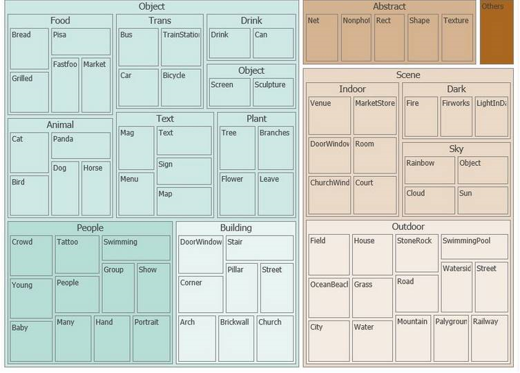
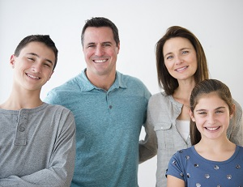
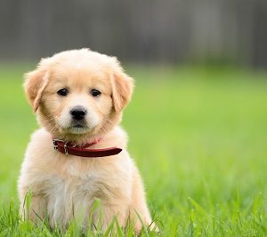
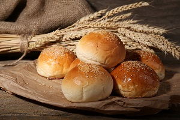

# Categorizing images

In addition to tagging and descriptions, Computer Vision returns the taxonomy-based categories defined in previous versions. These categories are organized as a taxonomy with parent/child hereditary hierarchies. All categories are in English. They can be used alone or with our new tagging models.

## The 86-category concept

Based on a list of 86 concepts seen in the following diagram, an image can be categorized ranging from broad to specific. For the full taxonomy in text format, see [Category Taxonomy](category-taxonomy.md).



## Image categorization examples

The following JSON response illustrates what Computer Vision returns when categorizing the example image based on its visual features.


```json
{
    "categories": [
        {
            "name": "people_",
            "score": 0.81640625
        }
    ],
    "requestId": "bae7f76a-1cc7-4479-8d29-48a694974705",
    "metadata": {
        "height": 200,
        "width": 300,
        "format": "Jpeg"
    }
}
```

The following table illustrates a typical image set and the category returned by Computer Vision for each image.

| Image | Category |
|-------|----------|
|  | people_group |
|  | animal_dog |
|  | outdoor_mountain |
|  | food_bread |

## Next steps

Learn concepts about [tagging images](concept-tagging-images.md) and [describing images](concept-describing-images.md).