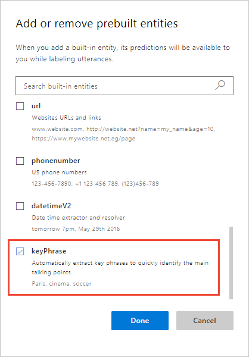
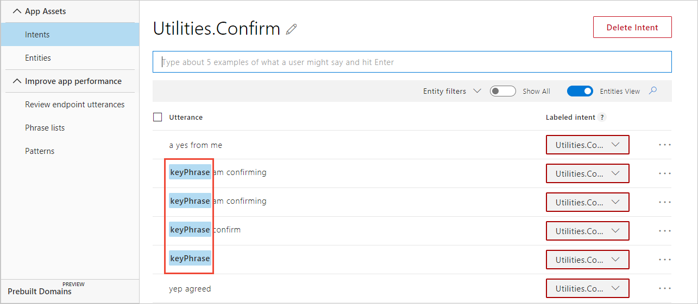

---
title: "Tutorial 8: key phrase extraction in LUIS"
titleSuffix: Azure Cognitive Services
description: Use keyPhrase prebuilt entity to extract key subject matter from utterances. You do not need to label any utterances with prebuilt entities. The entity is detected automatically.
services: cognitive-services
author: diberry
manager: cgronlun

ms.service: cognitive-services
ms.component: language-understanding
ms.topic: tutorial
ms.date: 09/09/2018
ms.author: diberry
#Customer intent: As a new user, I want to understand key subject matter in a user's utterances. 

--- 

# Tutorial 8: Extract key phrases of utterance
In this tutorial, use the prebuilt keyPhrase entity to extract key subject matter from utterances. You do not need to label any utterances with prebuilt entities. The entity is detected automatically.

The following utterances show examples of key phrases:

|Utterance|keyPhrase entity values|
|--|--|
|Is there a new medical plan with a lower deductible offered next year?|"lower deductible"<br>"new medical plan"<br>"year"|
|Is vision therapy covered in the high deductible medical plan?|"high deductible medical plan"<br>"vision therapy"|

Your client application can use these values, along with other extracted entities, to decide the next step in the conversation.

**In this tutorial, you learn how to:**

<!-- green checkmark -->
> [!div class="checklist"]
> * Use existing tutorial app
> * Add keyPhrase entity 
> * Train
> * Publish
> * Get intents and entities from endpoint

[!INCLUDE [LUIS Free account](../../../includes/cognitive-services-luis-free-key-short.md)]

## Use existing app

Continue with the app created in the last tutorial, named **HumanResources**. 

If you do not have the HumanResources app from the previous tutorial, use the following steps:

1.  Download and save [app JSON file](https://github.com/Microsoft/LUIS-Samples/blob/master/documentation-samples/tutorials/custom-domain-simple-HumanResources.json).

2. Import the JSON into a new app.

3. From the **Manage** section, on the **Versions** tab, clone the version, and name it `keyphrase`. Cloning is a great way to play with various LUIS features without affecting the original version. Because the version name is used as part of the URL route, the name can't contain any characters that are not valid in a URL.

## Add keyPhrase entity 
Add keyPhrase prebuilt entity to extract subject matter from utterances.

1. [!include[Start in Build section](../../../includes/cognitive-services-luis-tutorial-build-section.md)]

2. Select **Entities** from the left menu.

3. Select **Add prebuilt entity**.

4. In the pop-up dialog, Select **keyPhrase**, then select **Done**. 

    [ ](./media/luis-quickstart-intent-and-key-phrase/hr-add-or-remove-prebuilt-entities.png#lightbox)

5. Select **Intents** from the left menu, then select the **Utilities.Confirm** intent. The keyPhrase entity is labeled in several utterances. 

    [ ](./media/luis-quickstart-intent-and-key-phrase/hr-keyphrase-labeled.png#lightbox)

## Train

[!INCLUDE [LUIS How to Train steps](../../../includes/cognitive-services-luis-tutorial-how-to-train.md)]

## Publish

[!INCLUDE [LUIS How to Publish steps](../../../includes/cognitive-services-luis-tutorial-how-to-publish.md)]

## Get intent and entities from endpoint

1. [!INCLUDE [LUIS How to get endpoint first step](../../../includes/cognitive-services-luis-tutorial-how-to-get-endpoint.md)]

2. Go to the end of the URL in the address and enter `does form hrf-123456 cover the new dental benefits and medical plan`. The last querystring parameter is `q`, the utterance **query**. 
    
    ```JSON
    {
      "query": "does form hrf-123456 cover the new dental benefits and medical plan",
      "topScoringIntent": {
        "intent": "FindForm",
        "score": 0.9300641
      },
      "intents": [
        {
          "intent": "FindForm",
          "score": 0.9300641
        },
        {
          "intent": "ApplyForJob",
          "score": 0.0359598845
        },
        {
          "intent": "GetJobInformation",
          "score": 0.0141798034
        },
        {
          "intent": "MoveEmployee",
          "score": 0.0112197418
        },
        {
          "intent": "Utilities.StartOver",
          "score": 0.00507669244
        },
        {
          "intent": "None",
          "score": 0.00238501839
        },
        {
          "intent": "Utilities.Help",
          "score": 0.00202810857
        },
        {
          "intent": "Utilities.Stop",
          "score": 0.00102957746
        },
        {
          "intent": "Utilities.Cancel",
          "score": 0.0008688423
        },
        {
          "intent": "Utilities.Confirm",
          "score": 3.557994E-05
        }
      ],
      "entities": [
        {
          "entity": "hrf-123456",
          "type": "HRF-number",git 
          "startIndex": 10,
          "endIndex": 19
        },
        {
          "entity": "new dental benefits",
          "type": "builtin.keyPhrase",
          "startIndex": 31,
          "endIndex": 49
        },
        {
          "entity": "medical plan",
          "type": "builtin.keyPhrase",
          "startIndex": 55,
          "endIndex": 66
        },
        {
          "entity": "hrf",
          "type": "builtin.keyPhrase",
          "startIndex": 10,
          "endIndex": 12
        },
        {
          "entity": "-123456",
          "type": "builtin.number",
          "startIndex": 13,
          "endIndex": 19,
          "resolution": {
            "value": "-123456"
          }
        }
      ]
    }
    ```

    While searching for a form, the user provided more information than was necessary to find the form. The additional information is returned as **builtin.keyPhrase**. The client application can use this additional information for a follow-up question, such as "Would you like to talk to a Human Resource representative about new dental benefits" or provide a menu with more options including "More information about new dental benefits or medical plan."

## Clean up resources

[!INCLUDE [LUIS How to clean up resources](../../../includes/cognitive-services-luis-tutorial-how-to-clean-up-resources.md)]

## Next steps

This tutorial added the prebuilt keyPhrase entity, quickly providing key phrases in utterances without having to label the utterances. 

> [!div class="nextstepaction"]
> [Add sentiment analysis to app](luis-quickstart-intent-and-sentiment-analysis.md)