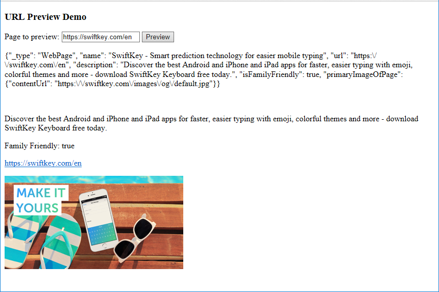

# Quickstart: URL Preview in JavaScript 

The following single-page application uses JavaScript to create a URL Preview for the SwiftKey site: https://swiftkey.com/en. 

## Prerequisites

Get an access key for the free trial [Cognitive Services Labs](https://labs.cognitive.microsoft.com/en-us/project-url-preview)

## Code scenario
The following javascript example includes a textbox input object where the user enters the URL to preview.  When the user clicks the **Preview** button, the onclick method routes to `getPreview` where code generates a Web request to the **UrlPreview** endpoint.

The code creates an *XMLHttpRequest*, adds the *Ocp-Apim-Subscription-Key* header and key, and sends the request.  It adds an asynchronous event handler to process the response.

If the response returns successfully, the handler assigns the JSON text of the response to the `demo` paragraph on the page. Other response elements are set to the following paragraphs for display.

**Raw JSON response**

````
{
  "_type": "WebPage",
  "name": "SwiftKey - Smart prediction technology for easier mobile typing",
  "url": "https://swiftkey.com/en",
  "description": "Discover the best Android and iPhone and iPad apps for faster, easier typing with emoji, colorful themes and more - download SwiftKey Keyboard free today.",
  "isFamilyFriendly": true,
  "primaryImageOfPage": {
    "contentUrl": "https://swiftkey.com/images/og/default.jpg"
  }
}

````

**The running demo**



## Running the application

To run the application:

1. Replace the `YOUR-SUBSCRIPTION-KEY` value with a valid access key for your subscription.
2. Save the HTML and script to a file with .html extension.
3. Run the Web page in a browser.
4. Use the existing URL, or enter another in the textbox.
5. Click the **Preview** button.

**Source code:**

```
<!DOCTYPE html>

<html lang="en" xmlns="http://www.w3.org/1999/xhtml">
<head>
    <meta charset="utf-8" />
    <title>urlPreview Demo</title>
</head>
<body>
    <h3>URL Preview Demo</h3>

    Page to preview: <input type="url" id="myURL" value="https://swiftkey.com/en">
    <button onclick="getPreview()">Preview</button>

    <p id="demo"></p>
    <br />
    <p id="jsonDesc"></p>
    <p><a id="familyFriendly"></a></p>
    <a id="contentUrl"></a>
    <p />
    

    <script>

        var BING_ENDPOINT = "https://api.labs.cognitive.microsoft.com/urlpreview/v7.0/search"; 
        var key = "YOUR-SUBSCRIPTION-KEY";
        var xhr;

        function getPreview() {
            xhr = new XMLHttpRequest();

            var queryUrl = BING_ENDPOINT + "?q=" +
                encodeURIComponent(document.getElementById("myURL").value);
            xhr.open('GET', queryUrl, true);
            xhr.setRequestHeader("Ocp-Apim-Subscription-Key", key);

            xhr.send();

            xhr.addEventListener("readystatechange", processRequest, false);
        }

        function processRequest(e) {

            if (xhr.readyState == 4 && xhr.status == 200) {
                document.getElementById("demo").innerHTML = xhr.responseText;
                var obj = JSON.parse(xhr.responseText);
                document.getElementById("jsonDesc").innerHTML = obj.description;
                document.getElementById("familyFriendly").innerHTML = "Family Friendly: " + obj.isFamilyFriendly;
                document.getElementById("contentUrl").innerHTML = obj.url;
                document.getElementById("contentUrl").href = obj.url;
                document.getElementById("jsonImage").width = 350;
                document.getElementById("jsonImage").src = obj.primaryImageOfPage.contentUrl;

            }

        }

    </script>

</body>
</html>

```

## Next steps
- [C# quickstart](csharp.md)
- [Java quickstart](java-quickstart.md)
- [Node quickstart](node-quickstart.md)
- [Python quickstart](python-quickstart.md)
