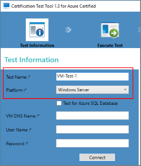
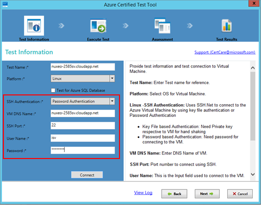
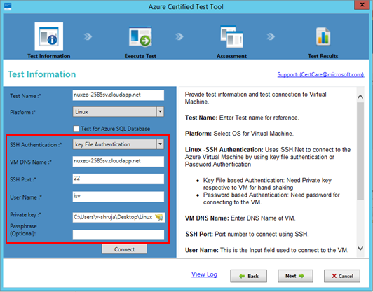
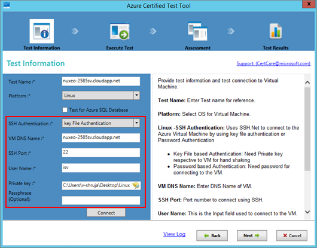
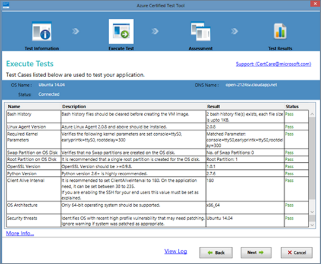
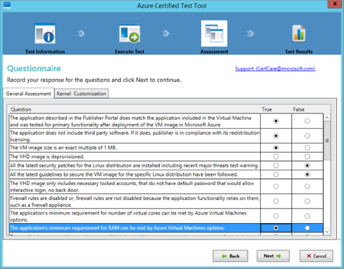
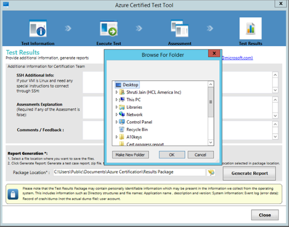

# Certify your VM image

After you create and deploy your virtual machine (VM), you must test and submit the VM image for Azure Marketplace certification. This article explains where to get the *Certification Test Tool for Azure Certified*, how to use this tool to certify your VM image, and how to upload the verification results to the Azure container where your VHDs reside. 

## Download and run the certification test tool

The Certification Test Tool for Azure Certified runs on a local Windows machine, but tests an Azure-based Windows or Linux VM.  It verifies that your user VM image is compatible with Microsoft Azure—that the guidance and requirements around preparing your VHD have been met. The output of the tool is a compatibility report, which you will upload to the [Cloud Partner Portal](https://cloudpartner.azure.com) to request VM certification.

1. Download and install the most recent [Certification Test Tool for Azure Certified](https://www.microsoft.com/download/details.aspx?id=44299). 
2. Open the certification tool, and then click  **Start New Test**.
3. From the **Test Information** screen, enter a **Test Name** for the test run.
4. Select the **Platform** for your VM, either `Windows Server` or `Linux`. Your platform choice affects the remaining options.
5. If your VM is using this database service, select the **Test for Azure SQL Database** checkbox.

   

## Connect the certification tool to a VM image

  The tool connects to Windows-based VMs with [PowerShell](https://docs.microsoft.com/powershell/) and connects to Linux VMs through [SSH.Net](https://www.ssh.com/ssh/protocol/).

### Connect the certification tool to a Linux VM image

1. Select the **SSH Authentication** mode: `Password Authentication` or `key File Authentication`.
2. If using password-­based authentication, enter values for the **VM DNS Name**,  **User name**, and **Password**.  Optionally, you can change the default **SSH Port** number.

     

3. If using key file-based authentication, enter values for the **VM DNS Name**, **User name**, and **Private key** location.  Optionally, you can supply a **Passphrase** or change the default **SSH Port** number.

     

### **Connect the certification tool to a Windows-based VM image**
1. Enter the fully qualified **VM DNS name** (for example, `MyVMName.Cloudapp.net`).
2. Enter values for the **User Name** and **Password**.

   

## Run a certification test

After you have supplied the parameter values for your VM image in the certification tool, select **Test Connection** to ensure a valid connection to your VM. After a connection is verified, select **Next** to start the test.  When the test is complete, a table is displayed with the test results (Pass/Fail/Warning).  The following example shows the test results for a Linux VM test. 

If any of the tests fail, your image is *not* certified. In this case, review the requirements and failure messages, make the indicated changes, and rerun the test. 

After the automated test, you are required to provide additional information about your VM image on the **Questionnaire** screen.  It contains two tabs that you must complete.  The **General Assessment** tab contains **True/False** questions, whereas the **Kernel Customization** contains multiple selection and freeform questions.  Complete the questions on both tabs then select **Next**.

The last screen enables you to provide additional information, such as SSH access information for a Linux VM image and an explanation for any failed assessments if you are seeking exceptions. 

Lastly, click **Generate Report** to download the test results and log files for the executed test cases in addition to your answers to the questionnaire. Save the results in the same container as your VHD(s).

## Next steps

You must next [generate a uniform resource identifiers (URI) for each VHD](./cpp-get-sas-uri.md) that you submit to the marketplace. 
