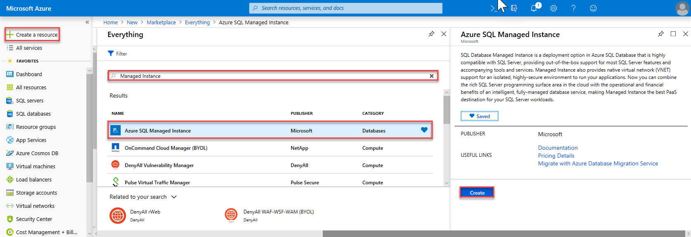
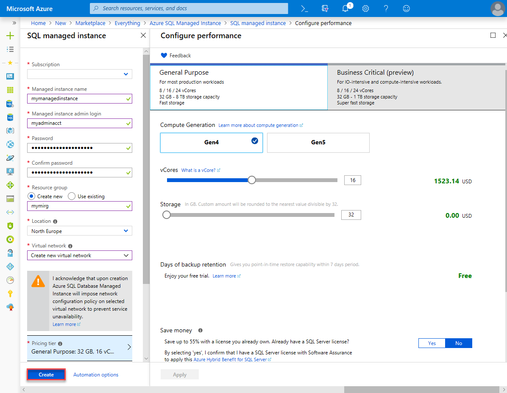
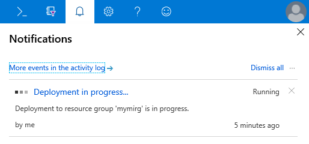
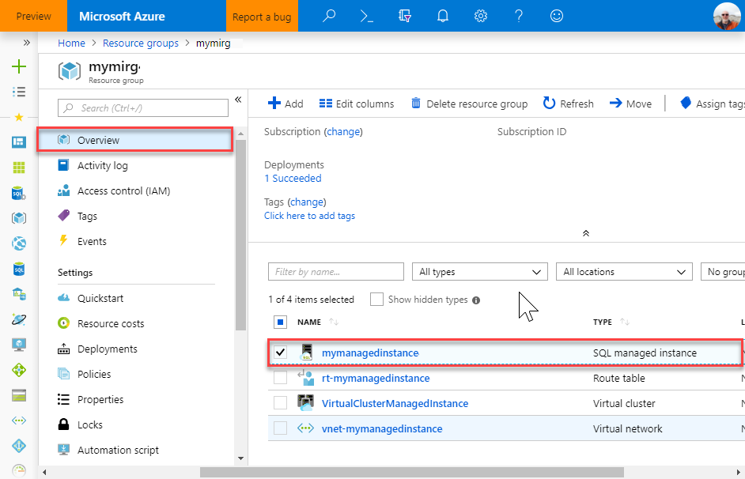
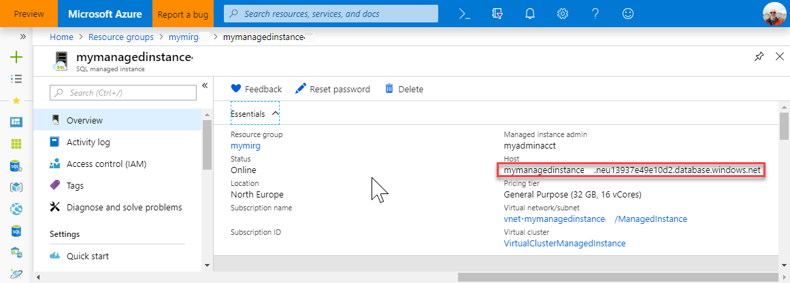

# Create an Azure SQL Database Managed Instance

This quickstart walks through how to create an Azure SQL Database [Managed Instance](sql-database-managed-instance.md) in the Azure portal. 

If you don't have an Azure subscription, create a [free](https://azure.microsoft.com/free/) account before you begin.

## Sign in to the Azure portal

Sign in to the [Azure portal](https://portal.azure.com/).

## Create a Managed Instance

The following steps show you how to create a Managed Instance.

1. Click **Create a resource** in the upper left-hand corner of the Azure portal.
2. Locate **Managed Instance** and then select **Azure SQL Managed Instance**.
3. Click **Create**.

   

4. Fill out the Managed Instance form with the requested information, using the information in the following table:

   | Setting| Suggested value | Description |
   | ------ | --------------- | ----------- |
   | **Subscription** | Your subscription | A subscription in which you have permission to create new resources |
   |**Managed instance name**|Any valid name|For valid names, see [Naming rules and restrictions](https://docs.microsoft.com/azure/architecture/best-practices/naming-conventions).|
   |**Managed instance admin login**|Any valid user name|For valid names, see [Naming rules and restrictions](https://docs.microsoft.com/azure/architecture/best-practices/naming-conventions). Do not use "serveradmin" as that is a reserved server-level role.| 
   |**Password**|Any valid password|The password must be at least 16 characters long and meet the [defined complexity requirements](../virtual-machines/windows/faq.md#what-are-the-password-requirements-when-creating-a-vm).|
   |**Resource Group**|A new or existing resource group|For valid resource group names, see [Naming rules and restrictions](https://docs.microsoft.com/azure/architecture/best-practices/naming-conventions).|
   |**Location**|The location in which you want to create the Managed Instance|For information about regions, see [Azure Regions](https://azure.microsoft.com/regions/).|
   |**Virtual network**|Select either **Create new virtual network** or a virtual network that you previously created in the resource group that you previously provided in this form| To configure a virtual network for a Managed Instance with custom settings, see [Configure SQL Managed Instance virtual network environment template](https://github.com/Azure/azure-quickstart-templates/tree/master/101-sql-managed-instance-azure-environment) in Github. For information regarding the requirements for configuring the network environment for a Managed Instance, see [Configure a VNet for Azure SQL Database Managed Instance](sql-database-managed-instance-vnet-configuration.md) |

   

5. Click **Pricing tier** to size compute and storage resources as well as review the pricing tier options. The General Purpose pricing tier with 32 GB of memory and 16 vCores is the default value.
6. Use the sliders or text boxes to specify the amount of storage and the number of virtual cores. 
7. When complete, click **Apply** to save your selection.  
8. Click **Create** to deploy the Managed Instance.
9. Click the **Notifications** icon to view the status of deployment.

    

10. Click **Deployment in progress** to open the Managed Instance window to further monitor the deployment progress. 

> [!IMPORTANT]
> For the first instance in a subnet, deployment time is typically much longer than in case of the subsequent instances. Do not cancel deployment operation because it lasts longer than you expected. Creating the second Managed Instance in the subnet only takes a couple of minutes.

## Review resources and retrieve your fully-qualified server name

After the deployment completes successfully, review the resources created and retrieve the fully qualified server name for use in later quickstarts.

1. Open the resource group for your Managed Instance and view its resources that were created for you in the [Create a Managed Instance](sql-database-managed-instance-get-started.md) quickstart.

   Open your Managed Instance resource in the Azure portal.

2. Click your Managed Instance.
3. On the **Overview** tab, locate the **Host** property and copy the fully-qualified host address for the Managed Instance.

   

   The name is similar to this: **your_machine_name.neu15011648751ff.database.windows.net**.

## Next steps

- To learn about connecting to a Managed Instance, see:
  - For an overview of the connection options for applications, see [Connect your applications to Managed Instance](sql-database-managed-instance-connect-app.md).
  - For a quickstart showing how to connect to a Managed Instance from an Azure virtual machine, see [Configure an Azure virtual machine connection](sql-database-managed-instance-configure-vm.md).
  - For a quickstart showing how to connect to a Managed Instance from an on-premises client computer using a point-to-site connection, see [Configure a point-to-site connection](sql-database-managed-instance-configure-p2s.md).
- To restore an existing SQL Server database from on-premises to a Managed instance, you can use the [Azure Database Migration Service (DMS) for migration](../dms/tutorial-sql-server-to-managed-instance.md) to restore from a database backup file or the [T-SQL RESTORE command](sql-database-managed-instance-get-started-restore.md) to restore from a database backup file.
- For advanced monitoring of Managed Instance database performance with built-in troubleshooting intelligence, see [Monitor Azure SQL Database using Azure SQL Analytics ](../log-analytics/log-analytics-azure-sql.md)
